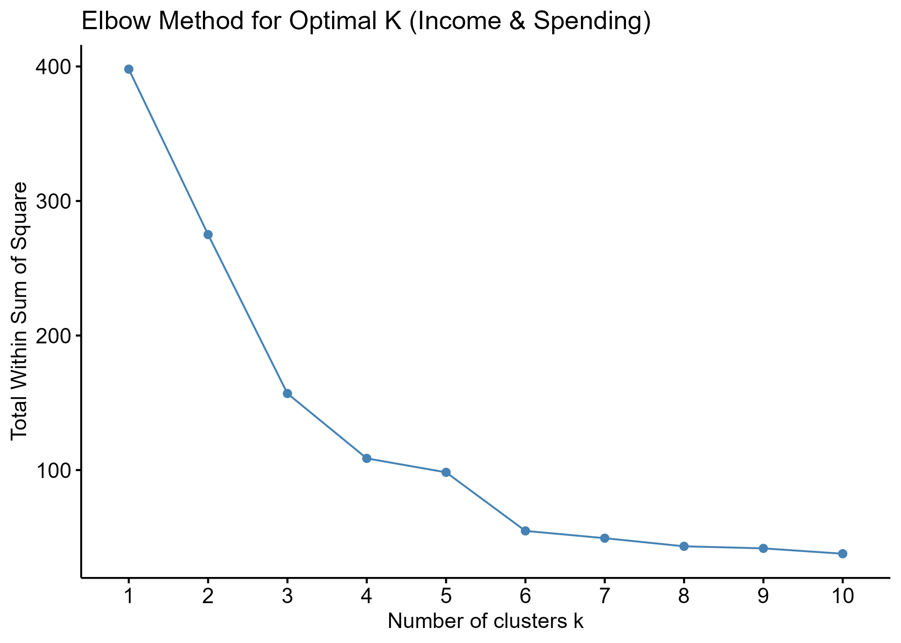
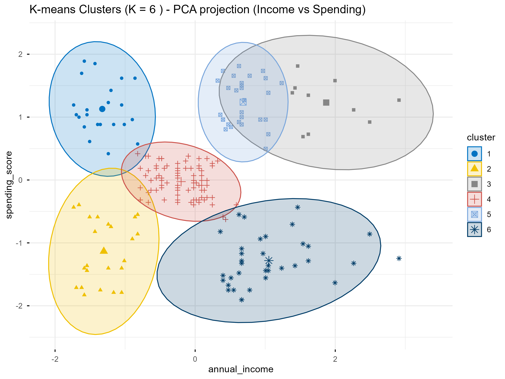
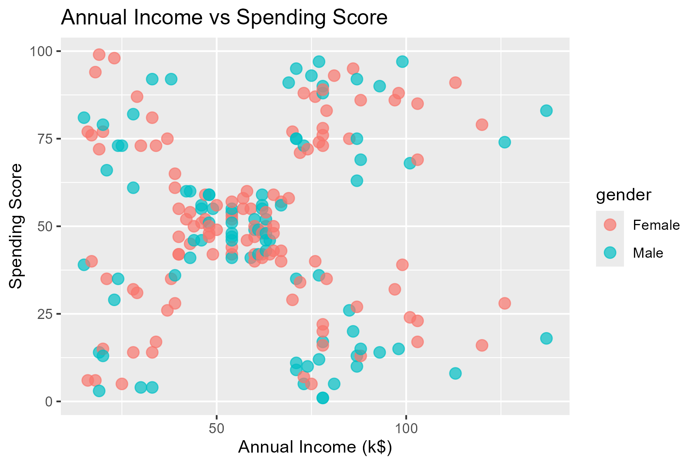

# 🛍️ Customer Segmentation and Behavioral Clustering using K-Means in R

---

## 📘 Overview

This project focuses on **Customer Segmentation** using the **Mall Customers Dataset (Kaggle)**.  
It uses **K-Means Clustering** to group customers based on their **Annual Income** and **Spending Score**, revealing distinct shopping behaviors and purchase patterns.

The entire workflow — from data preprocessing to cluster visualization — is implemented in **R**, leveraging popular data science libraries such as `dplyr`, `ggplot2`, and `factoextra`.

---

## 🎯 Objectives

- Perform **Exploratory Data Analysis (EDA)** to understand customer demographics and spending patterns.  
- Determine the **optimal number of clusters** using the Elbow and Silhouette methods.  
- Apply **K-Means Clustering** and visualize results using **PCA**.  
- Interpret each cluster to extract **business insights**.  
- (Optional) Build a **logistic regression model** to predict gender based on spending habits.

---

## 📂 Dataset

**Source:** [Mall Customers Dataset (Kaggle)](https://www.kaggle.com/datasets/vjchoudhary7/customer-segmentation-tutorial-in-python)
**File:** `Mall_Customers.csv`  

| Column Name       | Description                     |
|-------------------|---------------------------------|
| CustomerID        | Unique ID assigned to each customer |
| Gender            | Male/Female                     |
| Age               | Age of the customer             |
| Annual Income (k$)| Annual income in thousands      |
| Spending Score (1–100) | Spending behavior score assigned by mall |

---

## ⚙️ Libraries Used

| Library | Purpose |
|----------|----------|
| `dplyr` | Data manipulation and summarization |
| `ggplot2` | Visualization (histograms, scatterplots, boxplots) |
| `factoextra` | Clustering and PCA visualization |
| `cluster` | Silhouette analysis and cluster evaluation |
| `NbClust` | Optimal cluster determination |
| `caret` | Optional classification |
| `rpart`, `pROC` | Optional gender prediction model |

---

## 🧠 Project Workflow

### 🔹 1. Data Preparation
- Load and clean the dataset  
- Handle missing values (if any)  
- Select numeric columns for clustering (`Annual Income`, `Spending Score`)

### 🔹 2. Exploratory Data Analysis (EDA)
- Distribution of income and spending  
- Boxplots by gender and age groups  
- Correlation analysis between income and spending  

### 🔹 3. Finding Optimal Clusters
- Apply **Elbow Method** using `fviz_nbclust()`  
- Validate using **Silhouette Analysis**  

### 🔹 4. K-Means Clustering
- Train K-Means with optimal `k` (typically 5)  
- Assign cluster labels to each customer  
- Compare cluster centers  

### 🔹 5. Visualization
- Scatterplots of clusters  
- PCA-based visualization using `fviz_cluster()`  
- Distribution plots of income and spending per cluster  

---

## 🧩 Results Summary

| Cluster | Characteristics | Interpretation |
|----------|------------------|----------------|
| 1 | High Income, High Spending | Premium Shoppers |
| 2 | Moderate Income, Moderate Spending | Average Customers |
| 3 | High Income, Low Spending | Potential Customers |
| 4 | Low Income, High Spending | Impulsive Buyers |
| 5 | Low Income, Low Spending | Budget Shoppers |

---

## 📊 Visualizations

| Visualization | Description |
|----------------|--------------|
|  | Finding the optimal number of clusters |
|  | Customer segments visualized using PCA |
|  | Spending patterns by annual income |


---

## 💡 Business Insights

- **Cluster 1 (Premium Shoppers)**: Offer exclusive memberships, luxury promotions.  
- **Cluster 3 (Potential Customers)**: Target with personalized campaigns to increase spending.  
- **Cluster 4 (Impulsive Buyers)**: Promote discounts and seasonal offers.  
- **Cluster 5 (Budget Shoppers)**: Focus on affordability and loyalty discounts.  

---

## 🚀 How to Run the Project

### Step 1: Install Dependencies
```r
install.packages(c("dplyr", "ggplot2", "factoextra", "cluster", "NbClust", "caret", "rpart", "pROC", "scales"))
```

### Step 2 : Run the Scripts in Order
```r
source("01_load_and_clean.R")
source("02_eda_visuals.R")
source("03_optimal_clusters.R")
source("04_kmeans_clustering.R")
source("05_classification.R") # optional
```

## 🧱 Repository Structure
```bash
Project/
├── code/
│   └── 01_load_and_clean.r
│   └── 02_eda_visuals.r
│   └── 03_optimal_clusters.r
│   └── 04_kmeans_clustering.r
│   └── 05_classification.R
├── data/
│   └── Mall_Customers.csv
├── output/
│   ├── mall_customers_clean.csv
│   ├── mall_customers_with_clusters.csv
│   ├── tables/
│   |    ├── cluster_summary.csv
│   |    ├── sample_customers_per_cluster.csv
│   |    └── summary_stats.csv
│   └── plots/
│       ├── elbow.png
│       ├── kmeans_clusters_pca.png
│       └── income_vs_spend.png
└── README.md
```